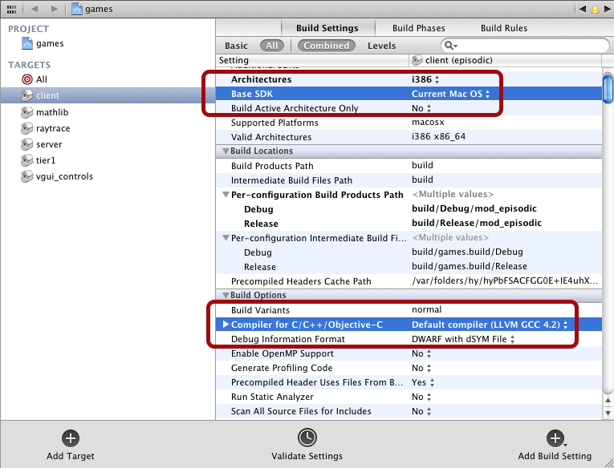

Source code for the free Steam game, Estranged: Act I. Built with the publicly available [source-sdk-2013](https://github.com/ValveSoftware/source-sdk-2013) from [Valve](https://github.com/ValveSoftware).

Getting Started
---------------
Once you've downloaded the code, head over to the src folder. You'll see two files, `creategameprojets` and `createallprojects`.

Double click `creategameprojects` to create the Xcode, Visual Studio or make files for the projects.

Building
--------
Binaries and symbols will be built into `game/estrangedact1/bin`.

### Visual Studio
Open `games.sln` in Visual Studio, and build it. In order to build the shader project, you will need to copy the Direct X 9 SDK headers into the `src/dx9sdk/include` folder.

### Xcode
Open `games.xcode`. Depending on which version of Xcode you have and which version of Mac OSX, you may need to set the Base SDK to "Current Mac OS", and the compiler for C/C++/Objective-C to LVVM GCC:

On some systems it is also necessary to create a symbolic link from your system's OpenGL header directory to build the shader project. To do this change into the `src/public` directory, and type the following:

* `ln -s /System/Library/Frameworks/OpenGL.framework/Headers GL`

### Linux with Make
Run `src/creategameprojects`. To build, type the following:

* `make -f src/games.mak`.

Similarly to the Xcode instructions above, it may be necessary to create a symbolic link from `src/public/GL` to your Linux distribution's OpenGL headers in order to build the shader project.

Running
-------
Copy the `game/estrangedact1` folder to `steam/steamapps/sourcemods`.

Allowed Usages
--------------
Please see [LICENSE.md](LICENSE.md) for allowed usages of the code.
